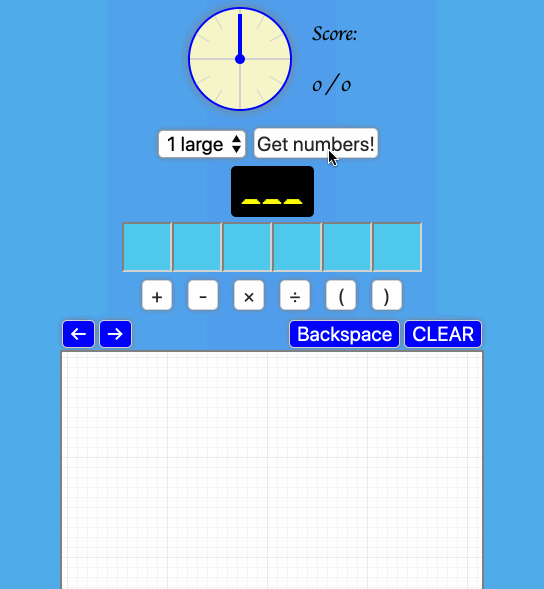

## Play the game

Currently available [here](https://katehoward10.github.io/countdown/)

## Run locally

1. In the command line, run `git clone git@github.com:KateHoward10/countdown.git`
2. Navigate into `/countdown`
3. Run `yarn` or `npm install` to install node_modules
4. Run `yarn start` or `npm start`
